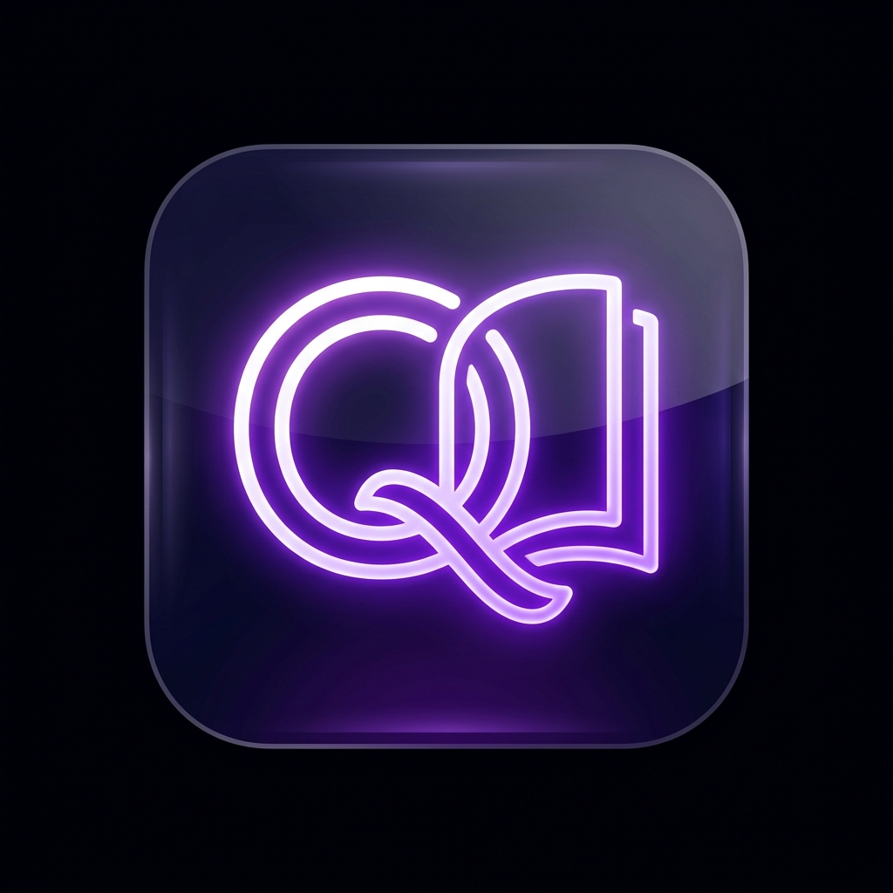
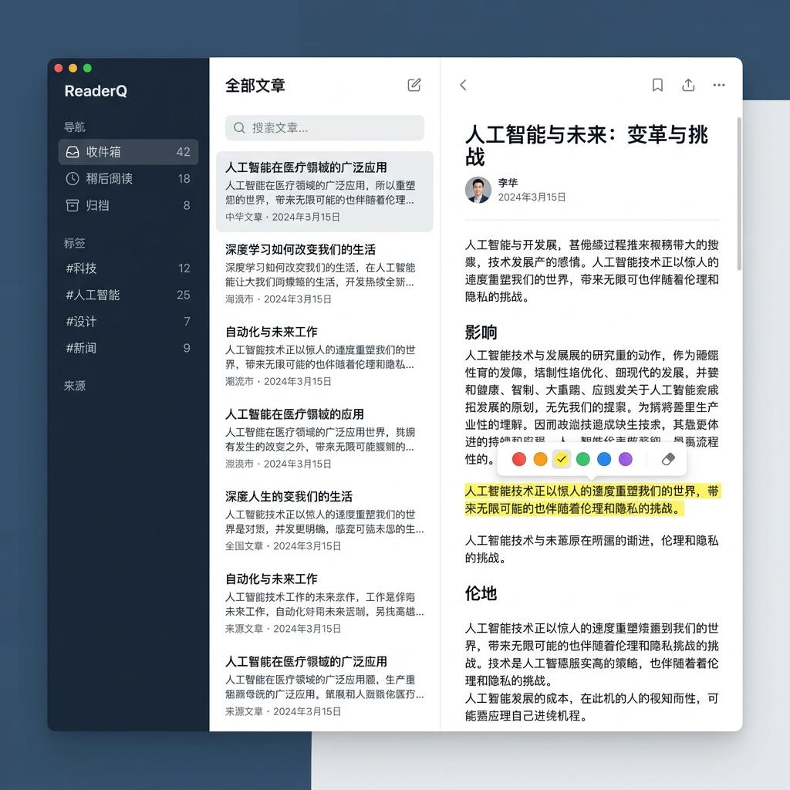
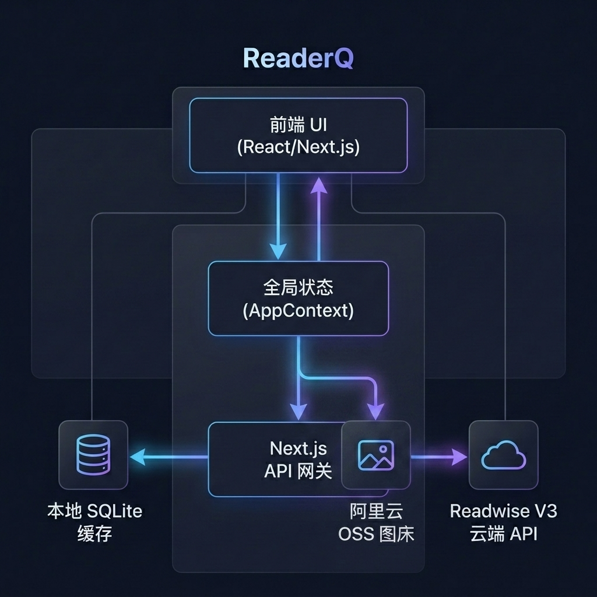

<p align="center">
  
</p>

<h1 align="center">ReaderQ</h1>

<p align="center">
  <strong>Readwise Reader 开源复刻版 — 智能阅读助手</strong>
</p>

集中管理、标注和消化你的数字阅读内容。使用 Readwise API 连接你的阅读数据，通过 OpenAI 兼容服务器驱动 AI 功能。致力于提供如丝般顺滑、闪电般快速的极致阅读体验。

## 📸 界面纵览



---

## 🏗️ 程序架构

ReaderQ 采用了前后端分离但高度内聚的架构体系，最大限度保证性能与体验：


- **前端架构 (Frontend)**: 基于 React (Next.js App Router)，通过统一的全局状态管理器 (`AppContext`) 分发数据，确保所有组件状态（如文档列表、阅读正文、高亮数据）保持同步。
- **后端架构 (Backend)**: Next.js API Routes 充当中转网关，与两大核心数据源交互：本地的高速 SQLite 缓存库 (`better-sqlite3`) 和远端 Readwise V3 API。
- **数据流转策略**:
  1. **首次加载**：从本地 SQLite 数据库秒开文档，同时在后台异步向 Readwise 拉取更新，实现“零等待”体验。
  2. **元数据更新**：对文档备注、标签或高亮的修改，会同时进行三步走战略：(1) 调用 Readwise API 保存至云端；(2) 写入本地 SQLite 落盘保存；(3) 触发前台乐观更新（Optimistic Updates），立刻反馈在 UI 上，彻底解决因 API 最终一致性带来的数据“幽灵消失”问题。

## 🎨 界面布局与设计

ReaderQ 采用经典的“三栏式”桌面级效率工具布局（可使用 `[` 和 `]` 快捷键自由折叠伸缩）：
1. **左侧导航栏 (Sidebar)**：提供全局导航，支持按视图（收件箱、归档等）、类型（PDF、文章、推文等）或标签对文档进行多维度过滤。
2. **中间列表区 (Document List)**：呈现阅读流，实时展现文档的标题、出处、预计阅读时间及阅读进度等元信息。
3. **右侧工作区 (Workspace)**：
   - **阅读面板 (Reading Pane)**：提供极净的无干扰阅读体验。长按选中文本即刻弹出高亮/批注悬浮窗，所见即所得。
   - **多标签页侧控台 (Right Panel)**：
     - **Info**：展示当前文档的基础信息。
     - **Notebook**：文档级笔记（Document Note）与多标签（Tags）的可视化智能编辑区，支持输入联想推荐；集中展示文章内所有的高亮及单条批注，支持与 Readwise 后台的单条校验。
     - **Chat (GhostReader)**：基于当前文档上下文的 AI 智能助手对话框，随时为你解惑、翻译或总结。

## 💡 设计思想与限制约束

### 设计思想
- **快即是正义**：本地 SQLite 的存在不是为了离线，而是为了**快**。通过缓存消除一切网络延迟的等待感。
- **所见即所得的极简美学**：UI 必须经得起长时间凝视。从平滑过渡动画到精准的字距/行高调节，每一处视觉都需克制且优雅。
- **交互的确定性**：所有的用户修改（包括增删高亮、编辑标签），必须在页面中提供确定的视觉反馈，并在底层通过“乐观更新”保证视觉连贯。

### 限制约束
- **API 最终一致性限制**：由于 Readwise V3 API 的读写存在微小延迟的“最终一致性”现象，前端不能在写入后立刻通过全局网络重新拉取，否则会遭遇数据倒退覆盖的 Race Condition。因此采用了局部更新内存状态的方案。
- **DOM 选择器限制**：由于浏览器的 Selection API 对复杂嵌套结构的限制，高亮模块采用了复杂的绝对偏移量计算 (`getTextOffset`) 进行恢复，确保刷新页面后高亮色块能毫厘不差地附着在原始文本上。

## ✨ 功能特性

### 📚 阅读与标注管理
- **丰富的过滤系统**：多维交叉筛选你的所有已存数字内容。
- **智能批注体验**：类原生应用的高亮选取体验，支持五种高亮色彩，以及针对单条高亮的备注与智能标签建议。
- **状态无缝同步**：所有的操作自动在云端完成同步对齐。

### 🖼️ 图床集成（阿里云 OSS）
- **自动图片上传**：高亮包含图片的内容时，自动将图片上传到阿里云 OSS 图床。
- **Markdown 格式转换**：上传完成后自动将图片引用转为 `` Markdown 格式，方便 Readwise API 接收和存储。
- **侧边栏图片预览**：在笔记面板中直接预览图床图片缩略图，实时确认上传状态（上传中 / 成功 / 失败）。
- **零依赖上传**：使用阿里云 OSS REST API 签名上传，无需额外安装 SDK。
- **一键测试连接**：在设置页面配置完成后，可一键验证 OSS 连接是否正常。

### 🤖 AI 助手 (GhostReader)
- **文档自动摘要与多语言翻译**
- **上下文深度理解**：随时划词询问，或者向当前阅读的文献发起全局提问。

## 🚀 部署与启停命令

支持 **macOS / Linux / Windows 11** 跨平台部署。

### 环境要求

| 依赖项 | 版本要求 | 说明 |
|--------|---------|------|
| Node.js | v20+ LTS | 推荐使用 LTS 版本 |
| npm | v9+ | 随 Node.js 一起安装 |
| Python | 3.x | Windows 编译原生模块时需要 |

> **🪟 Windows 用户额外要求**：`better-sqlite3` 是原生 C++ 模块，首次 `npm install` 时需要编译环境。请确保已安装以下工具之一：
> - **方式一（推荐）**：安装 [Visual Studio Build Tools](https://visualstudio.microsoft.com/visual-cpp-build-tools/)，勾选 **"使用 C++ 的桌面开发"** 工作负载
> - **方式二**：在管理员 PowerShell 中运行 `npm install -g windows-build-tools`
>
> 安装后如遇问题，可尝试设置：
> ```powershell
> npm config set msvs_version 2022
> ```

### 初始化项目

**macOS / Linux:**
```bash
git clone https://github.com/qxk2005/readerq.git
cd readerq
npm install
cp .env.example .env.local
```

**Windows (PowerShell):**
```powershell
git clone https://github.com/qxk2005/readerq.git
cd readerq
npm install
Copy-Item .env.example .env.local
```

### 环境配置 (`.env.local`)
```env
# 必须：Readwise V3 API Token (从 https://readwise.io/access_token 获取)
READWISE_API_TOKEN=your_token_here

# 可选：用于启用 GhostReader 的 OpenAI 兼容 API 配置
OPENAI_API_KEY=your_key_here
OPENAI_BASE_URL=https://api.openai.com/v1
OPENAI_MODEL=gpt-4o-mini

# 可选：阿里云 OSS 图床配置（也可在设置页面中配置）
# OSS_REGION=oss-cn-hangzhou
# OSS_BUCKET=your-bucket-name
# OSS_ACCESS_KEY_ID=your_access_key_id
# OSS_ACCESS_KEY_SECRET=your_access_key_secret
# OSS_CUSTOM_DOMAIN=https://img.example.com
# OSS_PATH_PREFIX=readerq
```

> **📷 图床配置说明**：OSS 配置支持两种方式——通过 `.env.local` 环境变量或在应用内「设置 → 图床配置」页面直接填写。Bucket 需开启**公共读**权限，以确保上传的图片可被外部访问。

### 启停命令 (CLI 工具)
系统内置了跨平台的快捷脚本用于服务生命周期管理：
```bash
# 启动或重启后台服务，自动清理被占用的 3000 端口
readerq --restart

# 服务成功启动后，将在后台持续运行，你可以访问:
# http://localhost:3000

# 查看后台日志 (macOS/Linux)
tail -f data/server.log

# 查看后台日志 (Windows PowerShell)
Get-Content data\server.log -Wait
```
*(你也可以使用传统的 `npm run dev` 在前台启动开发服务器，此方式在所有平台上均适用)*

## ⌨️ 快捷键速查

| 快捷键 | 功能 |
|--------|------|
| `⌘/Ctrl + K` | 呼出全局命令面板 |
| `⌘/Ctrl + N` | 快速添加新文章 |
| `⌘/Ctrl + Shift + A` | 唤起 AI 助手 |
| `⌘/Ctrl + Shift + S` | 强制同步云端数据 |
| `⌘/Ctrl + Shift + L` | 切换明暗主题 |
| `[` | 收起/展开左侧导航栏 |
| `]` | 打开/关闭右侧面板 |
| `Esc` | 关闭当前弹窗或取消选择 |

## 🛡️ 安全与技术栈

- **安全性**：密钥仅存在本地 `.env.local` 且不暴露给浏览器前端；本地 SQLite `.db` 文件静默存储在 `data/` 目录下不会上传远端仓库。
- **核心技术栈**: Next.js 15 (App Router), better-sqlite3, Vanilla CSS 变量驱动。
- **图床安全**：阿里云 OSS AccessKey ID 和 Secret 在 API 返回时自动脱敏，仅显示首尾各 4 位字符。

## 📄 许可证

MIT License

---

## 🤖 专属 AI 开发者指南 (AI System Prompt)

> **致未来的 AI 助手**：当你接手优化或重构此项目时，请务必首先阅读本指南。它包含了该项目最核心的设计哲学、数据流向和系统陷阱。

### 1. 核心技术栈与约定
- **框架**: Next.js 15 (App Router), React 19.
- **样式**: 纯原生 Vanilla CSS（使用 CSS Variables 管理主题，禁止引入 Tailwind 等外部框架）。
- **数据库**: `better-sqlite3`。使用 SQLite WAL 模式，确保读写并发性能。
- **状态管理**: 极简设计，抛弃 Redux，全局状态完全由 `src/context/AppContext.js` 托管和分发。

### 2. 目录架构索引
- `/src/app/api/`: 后端接口网关。
  - `/api/readwise/`: 专职负责与 Readwise V3 API 的增量/全量同步。
  - `/api/documents/` & `/api/highlights/`: 供前台调用的元数据修改接口，同时执行本地 SQLite 写入和 Readwise 远端同步。
  - `/api/ai/`: 统一个接管大模型调用的路由，抹平不同 LLM 厂家的 API 差异。
  - `/api/oss/`: 图床服务接口（`upload/` 图片上传、`test/` 配置测试）。
- `/src/components/`: 前端 UI 层。
  - `layout/`: 核心的三栏布局组件（`Sidebar`, `DocumentList`, `ReadingPane`）。
  - `ai/GhostReader.js`: AI 交互核心。
- `/src/lib/`: 核心工具库。
  - `db.js`: SQLite 物理层，封装建表与增删改查。
  - `readwise.js`: 封装向 Readwise 发起的 HTTP 请求。
  - `highlight.js`: 核心的高亮偏移量算法库。
  - `oss.js`: 阿里云 OSS 图床上传模块（REST API 签名、图片下载转存）。

### 3. 数据流与“双写三步走”铁律 ⚠️
Readwise V3 API 存在明显的**缓存最终一致性（Eventual Consistency）**现象。如果你向其 `PATCH` 了一个标签，紧接着立即 `GET` 拉取，极大概率会拿到修改前的旧数据。
**因此，涉及所有文档/高亮元数据的修改（如打标签、加备注），你必须严格执行以下三步走：**
1. **远端更新**：发送 HTTP `PATCH` 请求至 Readwise 云端 API。
2. **本地落盘**：调用 `upsertDocument` 更新本地 SQLite 数据库。
3. **乐观更新（Optimistic UI）**：通过 `AppContext` 提供的 `updateDocumentLocally(id, updates)` 直接更新 React 内存中的全局列表，**绝对禁止**在保存后立刻重新从云端 Fetch 刷新，否则会导致 UI 闪烁和数据丢失。

### 4. 脆弱的高亮引擎 (Highlight Engine)
本项目基于浏览器的原生 `Selection API` 实现高亮，核心逻辑在 `ReadingPane.js` 和 `src/lib/highlight.js`。
- 高亮的精确定位依赖于 `location_start`（字符偏移量）。
- HTML 正文的 DOM 结构**绝对不能被随意篡改**，任何在 `ReadingPane` 中擅自增删 `div`、替换特殊字符或修改 React `dangerouslySetInnerHTML` 渲染方式的行为，都会导致偏移量计算灾难性失效（高亮色块错位或消失）。在修改 `ReadingPane.js` 时请如履薄冰。

### 5. GhostReader AI 引擎
AI 助手使用了 `react-markdown` 引擎。针对特定的命令（如“翻译”、“简化”），为了避免 Readwise 生成的占位符（如 "This tweet contains no text."）污染 Prompt，代码需要直接从 `html_content` 中提取真实文本喂给大模型。
在增加新的 AI 功能时，请尽量复用 `/api/ai/` 目录下的鉴权和错误重试机制。
