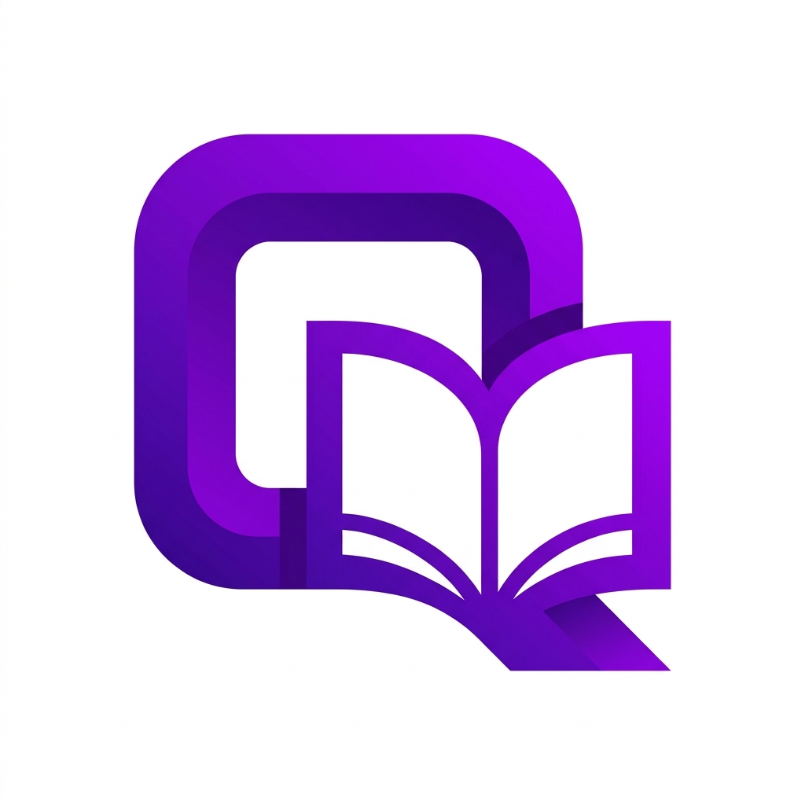
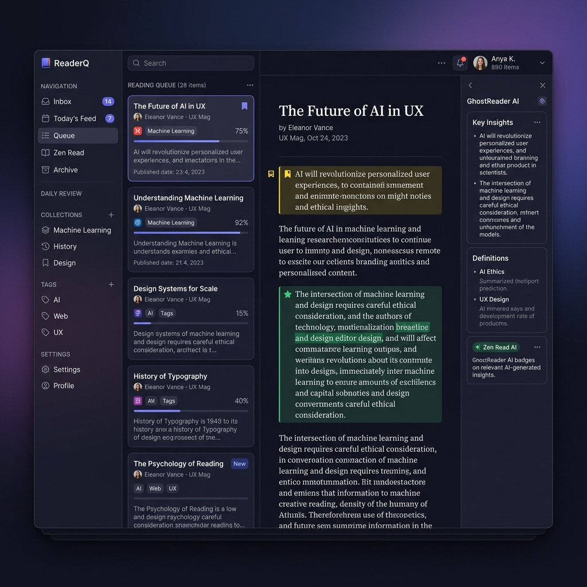
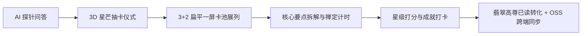

<p align="center">
  
</p>

<h1 align="center">ReaderQ</h1>

<p align="center">
  <strong>Readwise Reader 开源复刻与 AI 智导沉浸阅读系统</strong>
</p>

<p align="center">
  <a href="#-系统架构与设计">系统架构</a> •
  <a href="#-核心特色功能">核心功能</a> •
  <a href="#-禅阅读-zen-reading">禅阅读</a> •
  <a href="#-每日回顾-daily-review">每日回顾</a> •
  <a href="#-视频与-youtube-ai-转换">视频 AI 转换</a> •
  <a href="#-图床与云端同步">OSS 同步</a> •
  <a href="#-部署与运行指南">部署指南</a> •
  <a href="#-专属-ai-开发者指南-ai-system-prompt">AI 开发者指南</a>
</p>

---

ReaderQ 是一款致力于提供极致速度、优雅视觉与深度 AI 赋能的开源数字阅读与知识管理助手。它完美连接你的 **Readwise** 阅读数据，结合本地高速 **SQLite** 缓存、**阿里云 OSS** 多端同步以及 **OpenAI 兼容** 大模型驱动，提供从文章沉浸阅读、视频/字幕 AI 转换、禅意抽卡推荐到记忆曲线回顾的全链路知识消化体验。

---

## 📸 界面纵览



---

## 🏗️ 系统架构与设计

ReaderQ 采用了前后端分离但高度内聚的轻量化架构体系，兼顾秒级启动、离线高速响应与云端多端同步：

```mermaid
graph TD
    subgraph Frontend["前端展示与交互层 (React 19 / Next.js App Router)"]
        UI[三栏式主工作区 Sidebar + DocumentList + ReadingPane]
        Zen[禅阅读 ZenReadView (3D Gacha / 3+2 扁平一屏/ 固顶 Header)]
        Review[每日回顾 DailyReviewView (记忆曲线卡片)]
        Video[视频与字幕阅读器 VideoReadingPane]
        Ctx[全局状态中心 AppContext (内存乐观更新)]
    end

    subgraph Gateway["后端 API 网关 (Next.js 15 App Router Routes)"]
        API_Readwise[/api/readwise/...]
        API_Doc[/api/documents/...]
        API_Zen[/api/zen-read/...]
        API_Review[/api/daily-review/...]
        API_OSS[/api/oss/...]
        API_AI[/api/ai/...]
    end

    subgraph Data["数据持久化与远端服务 (Storage & External Cloud)"]
        DB[(本地 SQLite 数据库 better-sqlite3 WAL 模式)]
        RW[Readwise V3 Cloud API]
        OSS[阿里云 OSS 图床 & zen_read_profile.json 多端同步]
        LLM[OpenAI / DeepSeek / 兼容大模型 API]
    end

    UI --> Ctx
    Zen --> Ctx
    Review --> Ctx
    Video --> Ctx

    Ctx --> Gateway
    Gateway --> DB
    API_Readwise <--> RW
    API_OSS <--> OSS
    API_Zen <--> OSS
    API_AI <--> LLM
```

### 💡 核心设计理念

1. **零等待离线优先 (Offline-First Speed)**
   使用 `better-sqlite3`（WAL 模式）在本地完成元数据的高速索引与检索。页面秒级秒开，并在后台静默进行增量增量拉取与同步。
2. **三步走乐观更新 (Optimistic UI Pattern)**
   由于云端 API 存在“最终一致性”缓存延迟，用户打标签、加高亮或沉浸反馈时，系统同步执行：`(1) 远端 API 提交 -> (2) 本地 SQLite 写入 -> (3) 前台内存乐观更新`，彻底消灭 UI 闪烁和数据覆盖的Race Condition。
3. **沉浸式禅意与游戏化抽卡**
   独创“禅阅读”AI 智能抽卡系统，结合心境问答与 SSR / SR / R 3D 抽卡仪式，将长文阅读转化为富有趣味的知识探索。

---

## ✨ 核心特色功能

### 🧘 禅阅读 (Zen Reading) — AI 抽卡与沉浸消化

针对“收藏不读”的积压焦虑， ReaderQ 打造了游戏化与禅意相结合的阅读探索体验：


```mermaid
flowchart LR
    A[AI 探针问答] --> B[3D 星芒抽卡仪式]
    B --> C[3+2 扁平一屏卡池展列]
    C --> D[核心要点拆解与禅定计时]
    D --> E[星级打分与成就打卡]
    E --> F[翡翠高尊已读转化 + OSS 跨端同步]
```

- **AI 心境感应提问 (AI Probe Questions)**：基于用户当前阅读偏好与存量库，AI 动态生成 3 道探针提问，感应用户当下心境。
- **3D 抽卡仪式与 SSR / SR / R 阵型**：解封绚丽卡池，卡片以 **3+2 扁平化两行阵型** 在一屏内完美全显，包含 AI 推荐理由与 3D 动态倾斜视角。
- **已阅读卡牌高尊视觉变幻 (Emerald Theme)**：已读卡片自动转换为翡翠发光渐变主题与 `✅ 禅定已读` 成就勋章，避免未读/已读混淆。
- **常驻固顶工具栏 (Sticky Header Bar)**：阅读文章正文时，顶栏计时器、同步状态与返回导航绝对固定在视口正上方，正文独立平滑滚动。
- **数据跨端云同步**：通过阿里云 OSS 自动同步 `zen_read_profile.json` 偏好与评价档案，实现多端无缝衔接。

---

### 📅 每日回顾 (Daily Review) — 艾宾浩斯记忆曲线

- **智能卡片复习**：结合每日高亮与笔记碎片，基于记忆曲线自动生成每日回顾卡片。
- **深度联想与复盘**：点击卡片可直接定位回原文段落，方便温故知新并打卡记录。

---

### 🎬 视频与 YouTube 文章 AI 转换

- **视频字幕提取**：支持音视频与 YouTube 链接自动解析 SRT 字幕。
- **AI 博客转换 (Video-to-Blog)**：一键调用 AI 将视频与字幕重构为结构化的深度 Markdown 博客文章，自带思维导图与核心要点。
- **字幕同步导航**：阅读面板支持视频/字幕/博客模式切换，侧边栏与高亮位置实时联动。

---

### 🖼️ 图床与云端数据同步 (Aliyun OSS Support)

- **高亮图片自动上床**：选中文章包含图片的段落高亮时，自动将图片上传至阿里云 OSS 并转为 Markdown 图片格式。
- **Base64 Data URL & 相对路径解析**：自动解析 Base64 Data URL 图像并直接转 Buffer 上传；自动补全 `//` 与相对路径地址。
- **防盗链抓取支持**：自动注入 `Referer` 与标准浏览器 `User-Agent` Header，突破 Medium、微信公众号、知乎等站点的图片防盗链拦截。
- **掩码防御机制 (Masked Key Fallback)**：对 AccessKey 掩码字符（`•`）智能回退读取数据库真实凭证，严防 Node.js HTTP Header `ByteString` 崩溃异常。

---

## 🚀 部署与运行指南

支持 **macOS / Linux / Windows 11** 跨平台部署与打包。

### 环境要求

| 依赖项 | 版本要求 | 说明 |
|--------|---------|------|
| Node.js | v20+ LTS | 推荐使用 Node.js LTS 版本 |
| npm | v9+ | 随 Node.js 一起安装 |
| Python | 3.x | Windows 编译 better-sqlite3 原生模块时需要 |

> **🪟 Windows 用户编译说明**：`better-sqlite3` 包含 C++ 原生模块。首次 `npm install` 前请确保已安装 **Visual Studio Build Tools**（勾选 "使用 C++ 的桌面开发"）。

### 项目初始化

```bash
git clone https://github.com/qxk2005/readerq.git
cd readerq
npm install
cp .env.example .env.local
```

### 配置文件 (`.env.local`)

```env
# 必须：Readwise V3 API Token (从 https://readwise.io/access_token 获取)
READWISE_API_TOKEN=your_token_here

# 可选：用于启用 GhostReader 与 禅阅读 AI 功能的 OpenAI 兼容 API 配置
OPENAI_API_KEY=your_key_here
OPENAI_BASE_URL=https://api.openai.com/v1
OPENAI_MODEL=gpt-4o-mini

# 可选：阿里云 OSS 图床与多端同步配置（也可在系统「设置 → 图床配置」页面设置）
# OSS_REGION=oss-cn-hangzhou
# OSS_BUCKET=your-bucket-name
# OSS_ACCESS_KEY_ID=your_access_key_id
# OSS_ACCESS_KEY_SECRET=your_access_key_secret
# OSS_CUSTOM_DOMAIN=https://img.example.com
# OSS_PATH_PREFIX=readerq
```

### 服务启停管理 (CLI 命令)

```bash
# 启动或重启后台服务，自动清理 3000 端口占用
readerq --restart

# 查看后台运行日志 (macOS / Linux)
tail -f data/server.log

# 查看后台运行日志 (Windows PowerShell)
Get-Content data\server.log -Wait
```

*(或者在开发模式下直接运行 `npm run dev`)*

---

## 📦 Release 版本打包与发布 SOP (For Developers)

遵守工程严格的**版本一致性工作流 (Release Workflow Policy)**：

1. **版本优先提升**：在执行打包指令后，首先修改 `package.json` 中的 `version`（如 `1.0.96` -> `1.0.97`）并完成 `git commit`；
2. **双端双向同步编译**：
   - **本地 AAB 编译**：运行 `npm run build && cd android && ./gradlew bundleRelease`，生成本地最新的 `app-release.aab`（需配置 JDK 17）。
   - **GitHub Actions 云端发布**：打上与 `package.json` 一致的 Git Tag（如 `git tag v1.0.97`）并推送到远程 `git push origin main && git push origin v1.0.97`，自动触发多平台 Desktop 桌面客户端与 Android APK/AAB 云端构建。
3. **双端版本一致性核验**：确保 `package.json`、Git Tag、Android AAB 与桌面端版本号 100% 保持严格一致！

---

## ⌨️ 全局快捷键速查

| 快捷键 | 功能描述 |
|--------|----------|
| `⌘/Ctrl + K` | 呼出全局命令面板 |
| `⌘/Ctrl + N` | 快速添加新文章/视频 URL |
| `⌘/Ctrl + Shift + A` | 唤起 AI 助手 (GhostReader) |
| `⌘/Ctrl + Shift + S` | 强制与 Readwise 云端数据同步 |
| `⌘/Ctrl + Shift + L` | 切换主题 (明亮 / 深色 / 禅意) |
| `[` | 折叠/展开左侧导航栏 |
| `]` | 打开/收起右侧多功能面板 |
| `Esc` | 关闭当前弹窗或取消高亮选区 |

---

## 🤖 专属 AI 开发者指南 (AI System Prompt)

> **致未来的 AI 智能体/开发者助手**：当你接手维护、重构或扩展 ReaderQ 时，请务必遵守以下架构规范与铁律：

### 1. 核心技术栈与约定
- **框架**: Next.js 15 (App Router), React 19.
- **样式**: 原生 Vanilla CSS + CSS Variables 变量驱动（禁止引入 Tailwind 或重型组件库，保证最大灵活性与零性能损耗）。
- **数据库**: `better-sqlite3`（SQLite WAL 模式），相关数据库操作统一封装在 `src/lib/db.js`。
- **状态管理**: 极简设计，全局状态托管在 `src/context/AppContext.js`。

### 2. 核心源码结构索引
- `/src/app/api/` 后端网关接口：
  - `/api/readwise/`: 负责 Readwise V3 增量/全量同步。
  - `/api/zen-read/`: 禅阅读 AI 问答、抽卡推荐、星级评价与 OSS 偏好同步。
  - `/api/daily-review/`: 每日回顾与记忆曲线计算。
  - `/api/documents/` & `/api/highlights/`: 文章与高亮元数据增删改查。
  - `/api/oss/`: 阿里云 OSS 图片上传与连接测试。
- `/src/components/`:
  - `zen/ZenReadView.js`: 禅阅读 3D 抽卡与一屏卡池视图。
  - `layout/ReadingPane.js`: 文章主阅读器与高亮标注引擎。
  - `layout/Sidebar.js`: 左侧导航与多维度视图过滤。
  - `ai/GhostReader.js`: AI 上下文对话助手。
- `/src/lib/`:
  - `db.js`: SQLite 存储层（建表、索引与事务）。
  - `oss.js`: 阿里云 OSS REST API 签名、防盗链抓取与图片直传。
  - `highlight.js`: 绝对字符偏移量计算 (`getTextOffset`)。

### 3. 数据双写“三步走”铁律 ⚠️
Readwise V3 API 存在最终一致性（Eventual Consistency）延迟。所有涉及文档/高亮元数据的修改，必须严格执行：
1. 发送 HTTP `PATCH/PUT` 到 Readwise/后端 API；
2. 本地调用 `upsertDocument` 更新 SQLite 数据库；
3. 调用 `updateDocumentLocally(id, updates)` 执行内存乐观更新。**严禁在修改后立即通过 GET 全量重新拉取，否则会导致 UI 闪烁或 Race Condition 覆盖**。

### 4. 严禁破坏 HTML 渲染与高亮引擎
高亮精确定位依赖于 `location_start`（字符偏移量）。在 `ReadingPane.js` 中修改 DOM 结构或 React 渲染时，必须确保文本字符节点映射完全保持一致，防止高亮偏移量计算失效。

---

## 📄 许可证

MIT License
